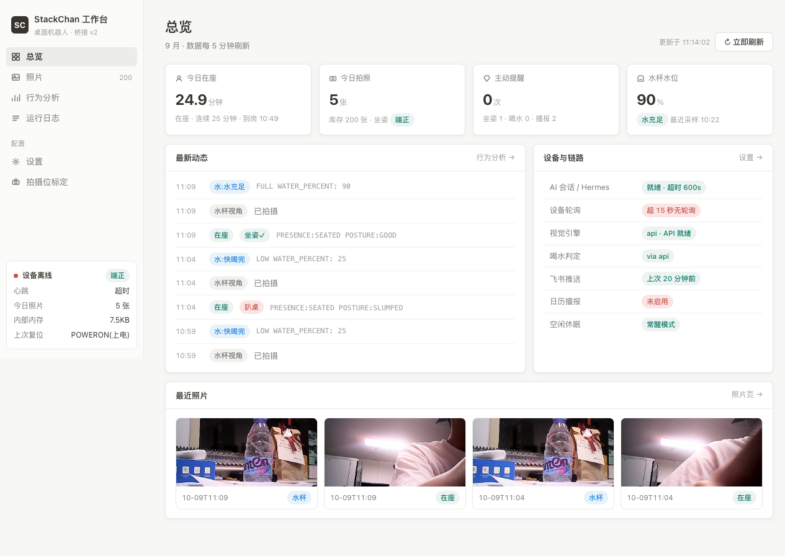
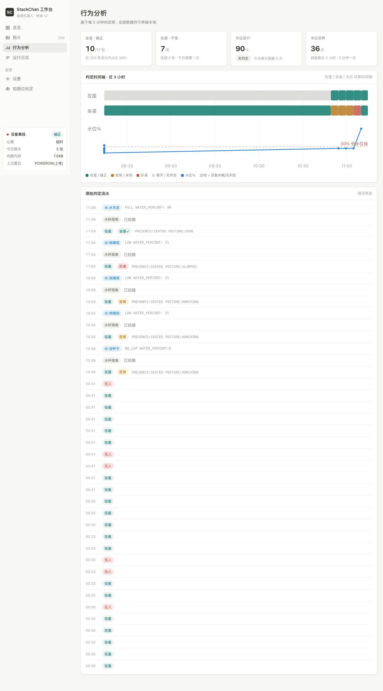
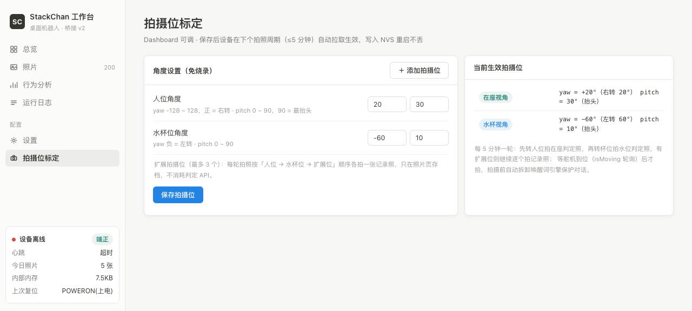
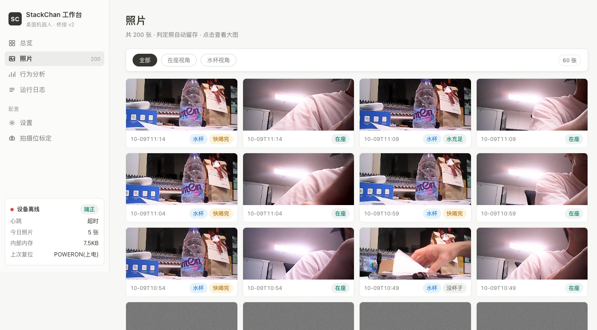

# ESP32 Robot Brain —— 带摄像头 ESP32 设备的通用"大脑"

> **EN TL;DR**: A generic "brain" service for camera-equipped ESP32 robots & devices — StackChan (M5Stack CoreS3 + xiaozhi-esp32) is the reference implementation. A Python/Flask service that turns periodic camera snapshots into health & presence judgments (seated-posture / water-level / behavior analysis) using OpenCV or cloud vision APIs, drives voice reminders through the robot's TTS, pushes long results to Feishu Lark, and ships a Notion-style web dashboard with hot-reconfigurable settings (no firmware re-flash needed).

**带摄像头的 ESP32 机器人/设备的通用"大脑"** —— StackChan 桌面机器人（M5Stack CoreS3 / xiaozhi-esp32 固件）是官方参考实现，但任何能上传照片、能轮询配置接口的 ESP32 设备都可以接入。

**工作方式**：Python/Flask 桥接服务，定时接收设备拍摄的照片 → OpenCV/云视觉 API 判定在座/坐姿/水位 → 规则引擎防骚扰地触发语音提醒与飞书留痕 → 附带 Notion 风格 Web 工作台，拍摄位、空闲休眠等参数全部免烧录热配置。

> 💡 **不只是 StackChan**：桥接侧只约定了两件事——设备按周期 POST 照片到 `/vision`、按周期 GET `/device_config` 拉取热配置。用 ESP32 开发板自制的摄像头小车、看护终端、桌面伴侣……只要实现这两条 HTTP 协议，就能复用整套判定、提醒、分析与 Dashboard 能力。


---

## 界面速览









## 它能做什么

| 能力                 | 说明                                                      |
| ------------------ | ------------------------------------------------------- |
| 🪑 **在座判定 & 久坐提醒** | 每 5 分钟一帧 → OpenCV 人脸（YuNet）+ 帧差双判据；连续在座超时提醒，"起身倒水不清零"防抖 |
| 💧 **喝水提醒（水位追踪）**  | 第二拍摄位对准水杯，云视觉 API 判水位百分比；水位停滞 + 人在座 → 提醒喝水              |
| 🧘 **坐姿分析**        | 在座照顺带判 GOOD/HUNCHING/SLUMPED，连续不佳才提醒（规则引擎防骚扰：冷却 + 每日上限） |
| 📸 **多拍摄位热配置**     | 人位/水杯位之外支持最多 3 个自定义拍摄位，Web 台上填角度即可，NVS 持久化、免烧录          |
| 📊 **行为分析三泳道**     | 在座 / 坐姿 / 水位对齐时间轴，一图两判不加 API 费                          |
| 🛡️ **稳定性遥测**      | 设备随配置拉取上报复位原因/内存水位，异常重启自动归档告警                           |
| 🗓️ **飞书反向通道**     | 日历到点 → 机器人开口播报；@机器人下指令 → 派发本机 Agent 干活 → 结果回飞书          |
| 🌙 **空闲休眠热配置**     | 陪伴常醒 / 空闲 N 分钟休眠，Dashboard 开关切换                         |

## 架构

```
StackChan 机器人 (ESP32-S3, xiaozhi-esp32 固件)
   │  ① 定时拍照 POST /vision（人位→水杯位→扩展位）
   │  ② 轮询 /pending 取提醒任务    ③ GET /device_config 拉热配置（ver 增量）
   ▼
pc-bridge 桥接服务 (Python/Flask, :8787, 仅局域网)   ← 本仓库
   │  在座判定(OpenCV/云视觉 API) · 规则引擎防骚扰 · TTS 合成 · 行为分析
   │  Web 工作台 /dashboard（纯前端，数据接口解耦）
   ▼
Hermes Agent（可选）→ 飞书留痕/推送
```

**设计原则**：机器人只做「耳/眼/手」，长内容一律推飞书不朗读；桥接只监听局域网；判定结果按语义分支入库，照片不出局域网（除非显式配置云 API）。

## 仓库结构

```
esp32-robot-brain/
├── bridge_server.py      # 桥接服务（大脑）：判定/规则引擎/TTS/飞书
├── dashboard.html        # Notion 风格 Web 工作台（纯前端）
├── config.example.yaml   # 配置模板（start.sh 自动复制为 config.yaml）
├── tests/                # 回归 + 冒烟测试
├── docs/screenshots/     # 界面截图
└── firmware/             # 设备端固件（ESP-IDF，M5Stack CoreS3）
    ├── main/             #   定制 HAL：拍摄位调度 / 热配置 / BLE 配网
    ├── components/esp-ml307/  #   本地组件覆盖：TcpClient 析构竞态修复
    ├── patches/          #   上游 xiaozhi-esp32 集成补丁
    └── fetch_repos.py    #   一键拉取上游依赖（repos.json）
```

## 快速开始

```bash
git clone https://github.com/<you>/esp32-robot-brain.git
cd esp32-robot-brain
./start.sh start        # 首次自动建 venv 装依赖（含 opencv ~50MB），
                        # 并从 config.example.yaml 生成 config.yaml
./start.sh status       # 运行状态
./start.sh log          # 实时日志
./start.sh restart      # 改完 config.yaml 后重启
```

启动成功打印：

```
本机  : http://127.0.0.1:8787/health
局域网: http://<你本机IP>:8787/health   ← 固件里填这个
```

### 配置要点（`config.yaml`，首次由模板自动生成）

1. **设备鉴权**：`security.device_token` 设一个随机值（`openssl rand -hex 16`），同时写进固件编译配置 `CONFIG_STACKCHAN_BRIDGE_TOKEN`
2. **视觉判定**：`vision.mode` 选 `opencv`（免费本机）或 `api`（OpenAI 兼容协议，智谱 GLM-4V-Flash 免费）；api_key 优先读环境变量 `STACKCHAN_VISION_API_KEY`
3. **Hermes 集成（可选）**：`hermes.bin` 指向本机 Agent；`extra_args: ["--yolo"]` 可让机器人派发的任务免审批执行——**安全自负**，见文末免责声明
4. 提醒文案、生效时段、每日上限、冷却时间全部可配

### 固件（已内置，可直接烧录）

设备端固件**就在本仓库 `firmware/` 目录**，基于 M5Stack StackChan 官方开源固件定制（集成 [xiaozhi-esp32](https://github.com/78/xiaozhi-esp32) 生态，依赖清单见 `firmware/repos.json`），与桥接的对接协议：

`/vision` 拍照上传（`X-Photo-Type: seat/cup/ex1..3`）、`/pending` 轮询取播报、`/device_config` 拉取拍摄位与电源策略（ver 增量同步 + NVS 持久化）。

```bash
cd firmware
python3 ./fetch_repos.py            # 拉取上游依赖
source ~/esp/esp-idf-v6.0.3/export.sh
idf.py -B build set-target esp32s3
idf.py -B build build flash monitor # 烧录 M5Stack CoreS3
```

硬件要求：M5Stack CoreS3 + Stack-chan 机体（其它 ESP32-S3 + 摄像头板子需自行适配 HAL）。详见 [`firmware/README.md`](firmware/README.md)。  
上游修复说明：EspTcp teardown 竞态修复以本地组件覆盖方式内置（`firmware/components/esp-ml307/`），相关上游讨论见 [78/esp-ml307#61](https://github.com/78/esp-ml307/pull/61)。

## 自测（不碰机器人就能验证）

```bash
# 1. 健康检查
curl http://127.0.0.1:8787/health

# 2. 看当前状态（在座时长、最近一次判定、照片分析详情）
curl http://127.0.0.1:8787/status
```

## 测试

```bash
.venv/bin/python tests/test_regression.py   # 回归（离线，不发真实消息）
.venv/bin/python tests/smoke_live.py        # 冒烟（需服务在跑）
```

## 已知取舍

- Flask 开发服务器直接跑（单用户家庭/实验室场景；生产部署请自行包 WSGI）
- 提醒文案与判定 prompt 默认中文，其他语言需自行调整
- `--yolo` 无审批模式有真实风险（Agent 可无审批执行任意工具），只在理解后果的情况下开启
- 本服务面向**单机器人 + 单用户**的局域网场景设计，未做多用户/公网加固，请勿直接暴露公网

## License

[MIT](LICENSE) © 2026 artrobin-cn
